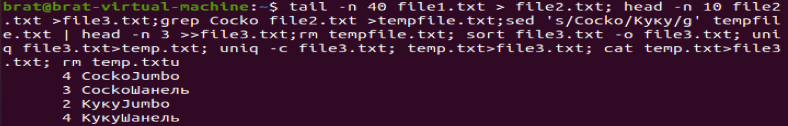

# WebBashLab1
## Команда
<pre>
<code>
tail -n 40 file1.txt > file2.txt; head -n 10 file2.txt >file3.txt;grep Cocko file2.txt >tempfile.txt;
sed 's/Cocko/Куку/g' tempfile.txt | head -n 3 >>file3.txt;rm tempfile.txt; sort file3.txt -o file3.txt; uniq file3.txt>temp.txt;
uniq -c file3.txt; temp.txt>file3.txt; cat temp.txt>file3.txt; rm temp.txt
</code>
</pre>
## Результат работы
</img>
